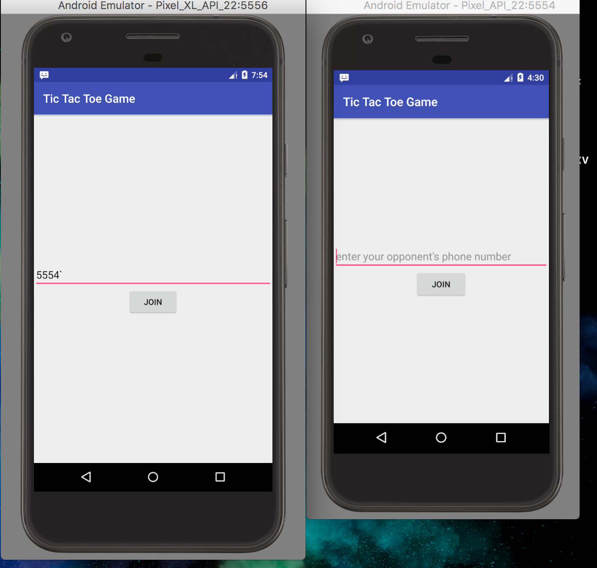
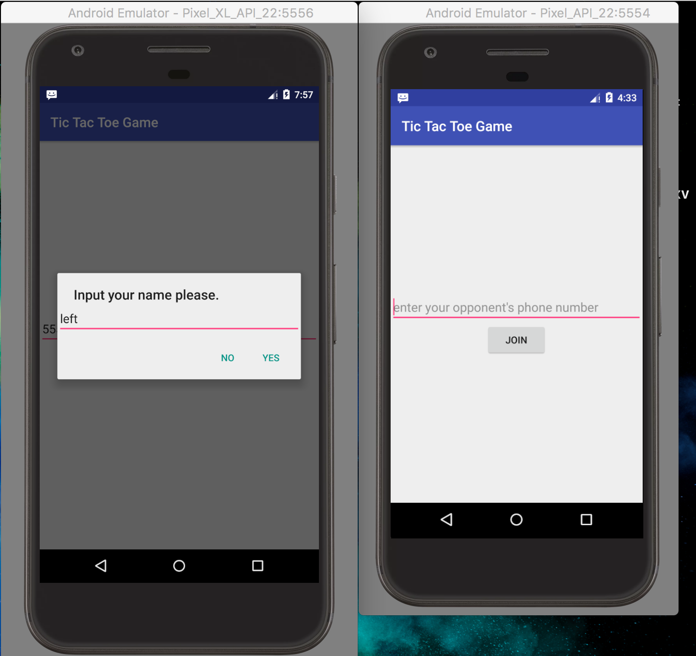
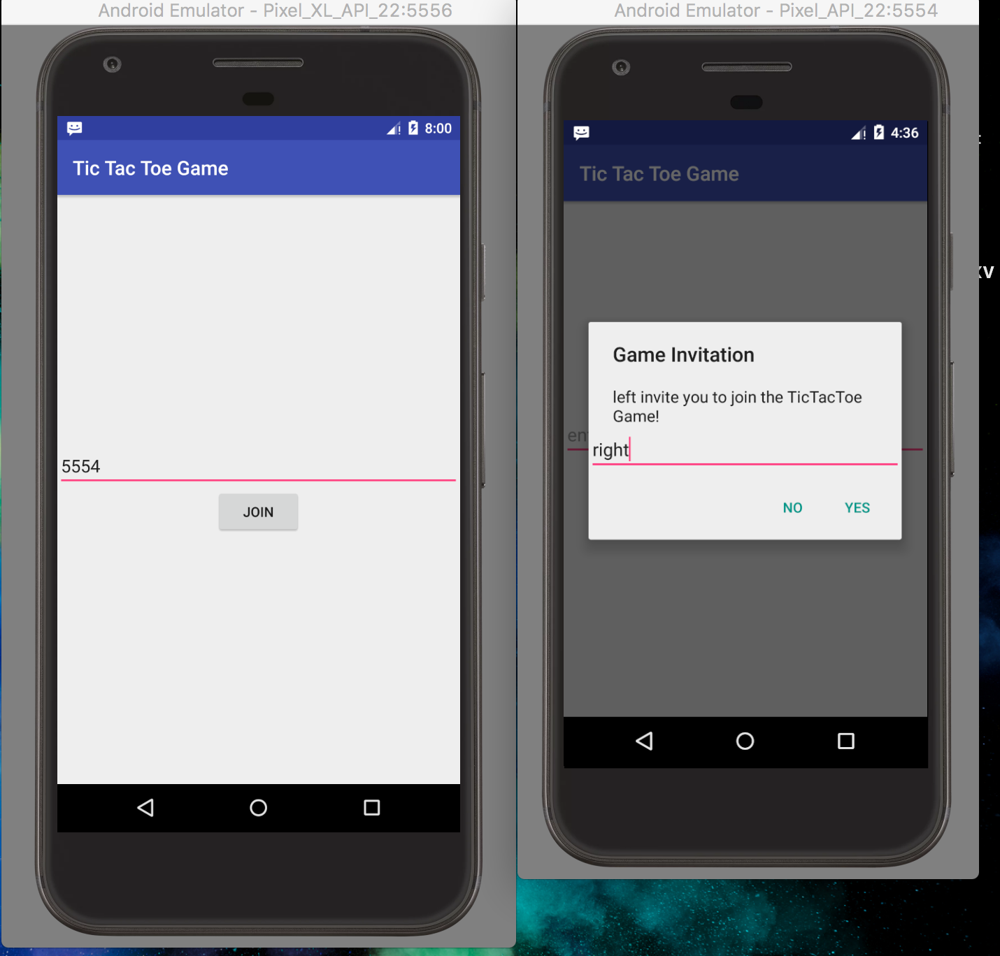
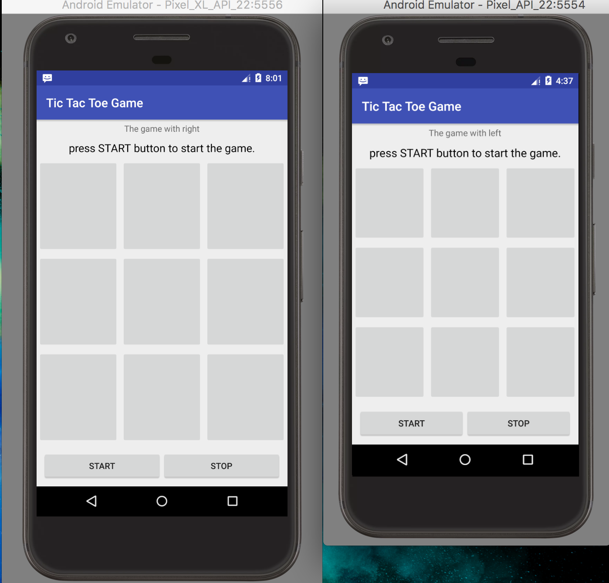
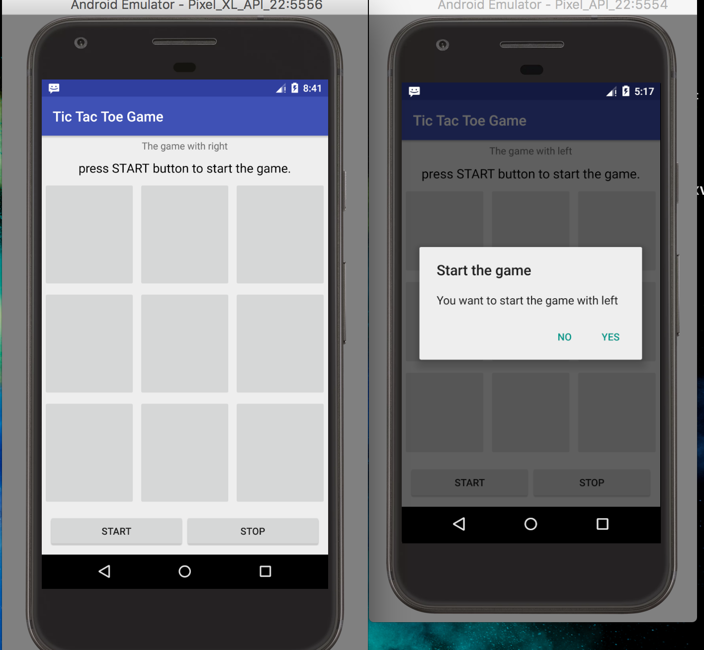
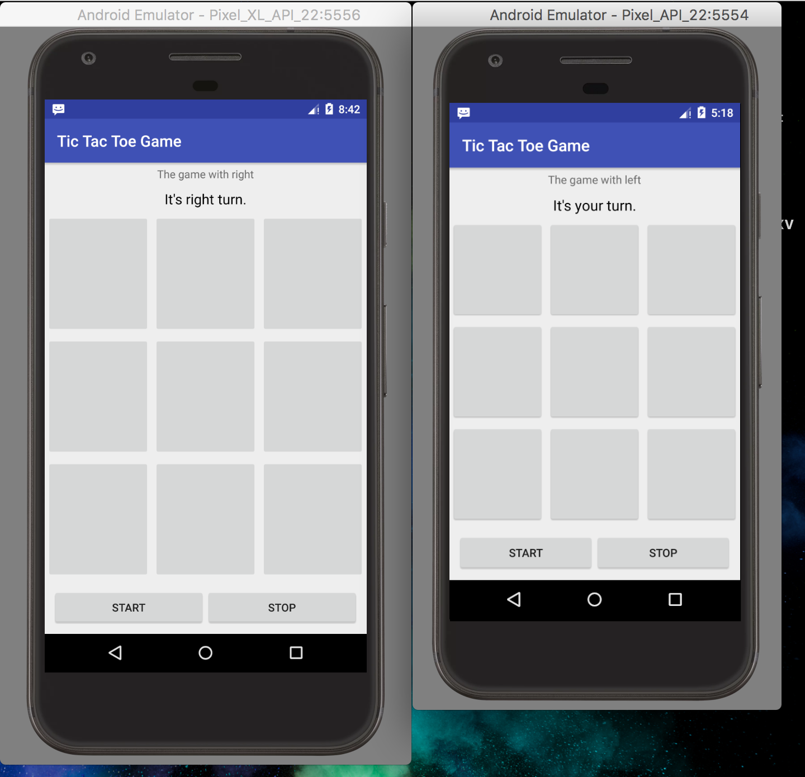
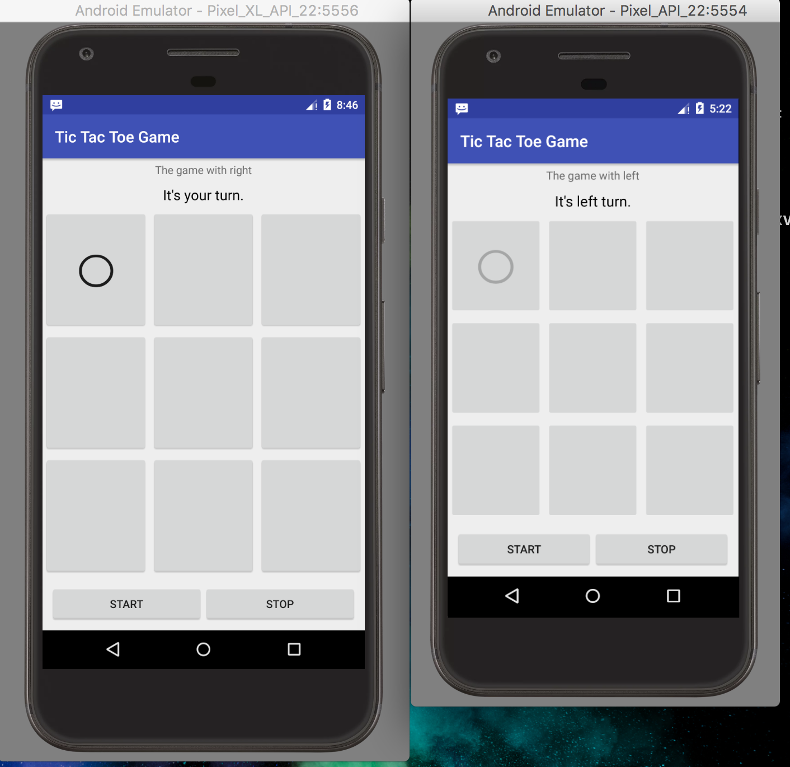
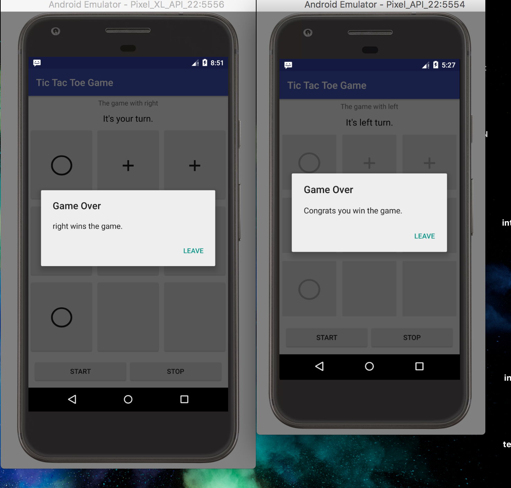

1. Open two simulator with the game installed, enter the right one's number into the left one, click join. The left one will show a dialog ask you to enter your name.

2. When you click yes on the left one's dialog, there will be a dialog on the right one asking you to enter name.

3. When you click yes, both left and right will go to the main screen.

4. Now you can start the game on both simulator. For example, you click the start button on the left, the right one will show up a dialog asking if you want to start the game.

5. If you click yes on the right one, the game is beginning.

6. The right one first to move.
7. move first on the right one.

8. at the end, when someone win this game, both simulator will get the notification

9. you click leave, go back to last screen.